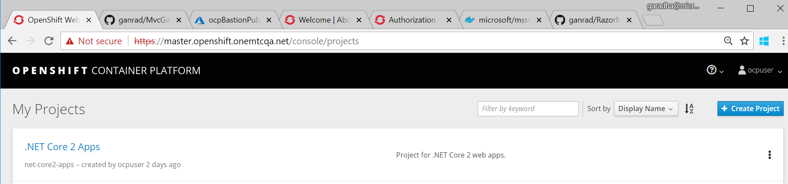
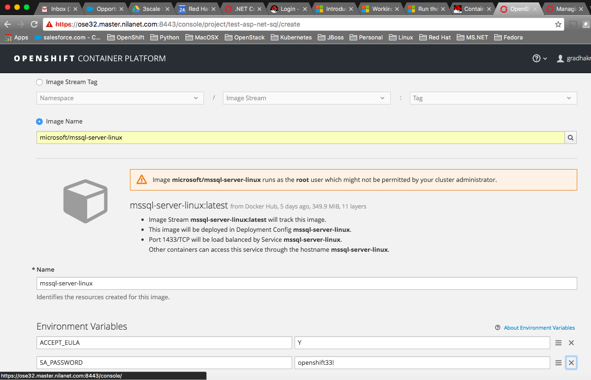
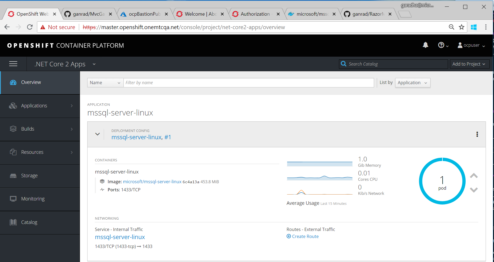
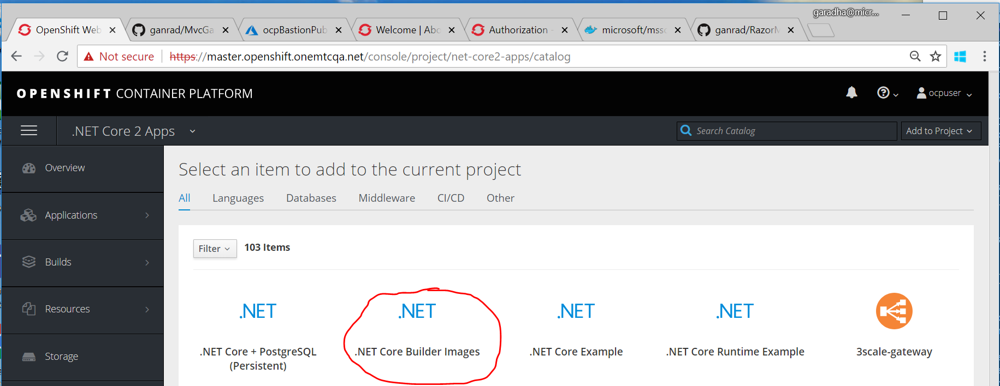
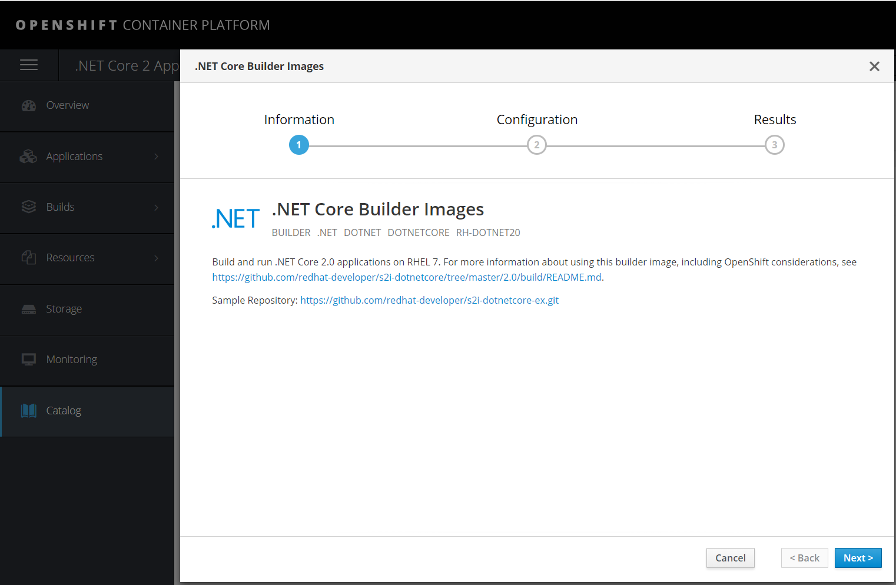
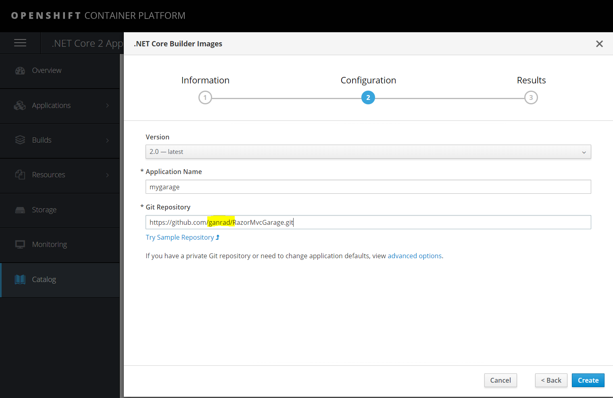
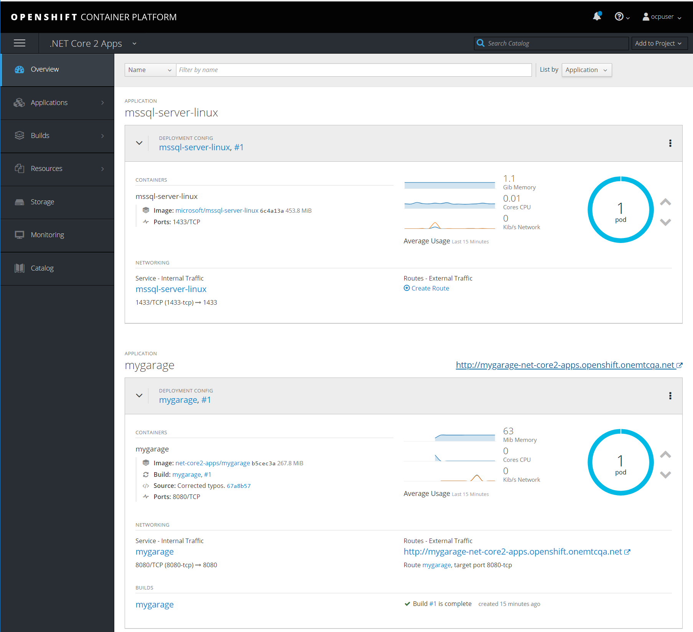
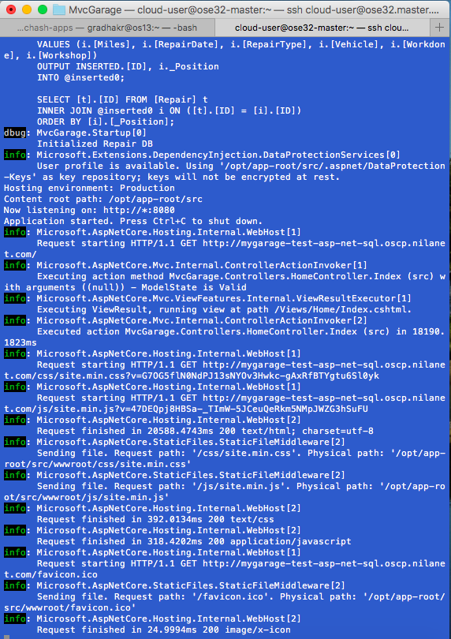
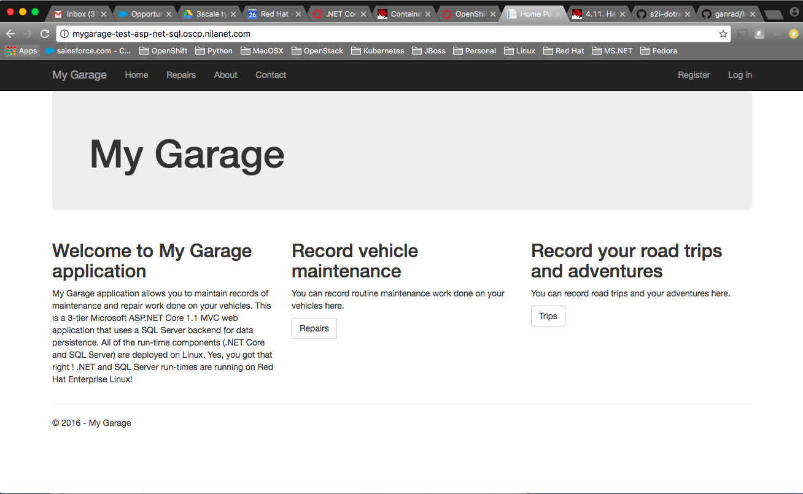
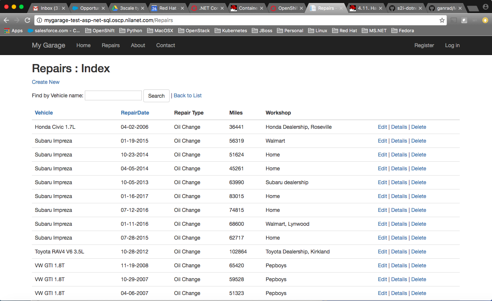

# A .NET Core 2.0 Razor Web Application running on OpenShift Container Platform v3.6+.

**Important Note:** This project assumes the readers have basic working knowledge of *Red Hat OpenShift Container Platform v3.6* (or upstream project -> OpenShift Origin) & are familiar with key underlying technologies such as Docker & Kubernetes.  Readers are also presumed to have hands-on experience developing web applications using Microsoft .NET and associated technologies.  The *My Garage* application is written in C#.  For that matter, readers familiar with any object oriented programming language should be able to follow along the instructions easily and deploy the ASP.NET web application to OpenShift CP.
For quick reference, readers can refer to the following on-line resources as needed.

1.  [OpenShift Container Platform Documentation](https://docs.openshift.com/)
2.  [Kubernetes Documentation](http://kubernetes.io/docs/user-guide/pods/)
3.  [OpenShift CP .NET Core S2I builder Image](https://docs.openshift.com/container-platform/3.6/using_images/s2i_images/dot_net_core.html)
4.  [ASP.NET Core](https://docs.microsoft.com/en-us/aspnet/core/)
5.  [.NET Entity Framework Core](https://docs.microsoft.com/en-us/ef/core/)
6.  [SQL Server on Linux](https://docs.microsoft.com/en-us/sql/linux/)
7.  [Visual Studio Code Overview](https://code.visualstudio.com/docs/introvideos/overview)
8.  [Get started with VS Code and .NET Core on MacOS](https://channel9.msdn.com/Blogs/dotnet/Get-started-with-VS-Code-using-CSharp-and-NET-Core-on-MacOS)

## Description
The *My Garage* application is a simple MVC (Model-View-Controller) Web Application that allows users to keep track of routine maintenance and other repair work done on their vehicles.
The application uses the following technologies -

1. .NET Core 2.0
2. ASP.NET Core 2.0
3. .NET EF Core 2.0
4. Microsoft SQL Server 2017 on Linux

## Steps for deploying the *My Garage* application on OpenShift CP v3.6 (or later)

### A] Create a new project in OpenShift CP using the web console.

1. Login into the OpenShift CP web console/UI and create a new project.  You can use any name and description for this project.  For instance, use 'net-core2-apps' for project name and '.NET Core 2 Apps' for display name.  Feel free to provide any meaningful description.  View screenshot below.

  

Next, we will deploy the SQL Server container.

### B] Deploy Microsoft SQL Server database container

1. The SQL Server container requires super user privileges (runs as user **root**) to run.  To satisfy this requirement, we will modify the *anyuid* security context constraint (SCC).  We will need to add the **default** service account to the list of users in this SCC. Use the OpenShift CLI command (shown below) to add the service account **system:serviceaccount:test-asp-net-sql:default** to the list of users.  Then save the SCC configuration.

 ```
 $ oc edit scc/anyuid
 ```
  * Bear in mind, you will need cluster administrator privileges to be able to modify an SCC.
 
2. In the OCP web console/UI, click on 'Add to project'.  Then click on 'Deploy Image' tab.  Within this tab, click on 'Image Name' field, enter text **microsoft/mssql-server-linux** and then hit search.  Leave the 'Name' field as is.  Add the two environment variables as shown in the screenshot below.

    

3. Next, click the *'Create'* button at the bottom of the web page.  This action will initiate the SQL Server container *deployment* process.  Behind the scenes, OpenShift will fetch the SQL Server docker container image from the docker registry (Docker Hub),  push the image into the integrated docker registry within OpenShift, create an image stream to associate the image with your project(/namespace) and then finally instantiate a container from this image.  This process should take approx. 3 to 5 minutes to complete.  As soon as the SQL Server container is successfully deployed, you should be able to view the container in the *Overview* tab in the left navigational panel as shown in the screenshot below.

    

4. Once the SQL Server container is up and running, we will create two database entities - 
  * A **repairsdb** database which will store all information entered by users of the application.  
  * A database user/login so that the *My Garage* application can connect to the database and store/retrieve pertinent information.

  In order to create these entities, we will first install the SQL Server CLI utility/tool **sqlcmd**.  You can install this utility on your local machine or on one of the OpenShift cluster nodes.  Follow the instructions [here](https://docs.microsoft.com/en-us/sql/linux/sql-server-linux-setup-tools) to install the **sqlcmd** utility/tool.

5. After installing the *sqlcmd* SQL Server CLI utility, login to the SQL Server instance running within the container.
 * Determine the service IP address of the SQL Server container
 ```
 $ oc get svc
 ```
 * Use the SQL Server service IP to connect to the instance via the *sqlcmd* CLI tool.  Replace the value of the placeholder (including *<>*) with the service IP address in the commmand below.  Also, make sure you are using the same *SA_PASSWORD* value which you provided in step [2] above.
 ```
 $ sqlcmd -S <Service IP> -U SA -P 'openshift33!'
 ```
 
6. Issue the following SQL Server CLI commands to create the database (*repairsdb*) and the application database user (*webuser*).
   * Create a database **repairsdb** 
   ```
   1> CREATE database repairsdb;
   2> GO
   ```
   * Add a new SQL Server instance user/login
   ```
   1> exec sp_addlogin @loginame = 'webuser', @passwd = 'P@ssw0rd’;
   2> GO
   ```
   * Switch to the *repairsdb* database
   ```
   1> USE repairsdb;
   2> GO
   ```
   * Grant database access to the user created above (**webuser**)
   ```
   1> exec sp_grantdbaccess 'webuser';
   2> GO
   ```
   * Grant permissions to user **webuser** so that he/she can perform all CRUD operations on all resources in database **repairsdb**
   ```
   1> grant CONTROL to webuser;
   2> GO
   ```
   * Exit the **sqlcmd** utility
   ```
   1> QUIT
   ```
7. You have now successfully completed the setup of the SQL Server database instance running within the docker container.  Next we will deploy the *My Garage* application container to OpenShift.  

  Here are a few other useful *sqlcmd* CLI commands which you might find handy.
  * List all database names and ID's
  ```
  1> SELECT SUBSTRING(name,1, 64), database_id FROM sys.databases ORDER BY name;
  2> GO
  ```
  * List all schemas
  ```
  1> select name from sys.schemas;
  2> GO
  ```
  * List all tables in the current database
  ```
  1> select table_name from information_schema.tables;
  2> GO
  ```

### C] Deploy the My Garage application within OpenShift CP using the web console/UI.
1.  Fork this Github repository so that it gets added to your account.

2.  Login into the OpenShift CP Web Console (if you haven't already).  Click on the *'net-core2-apps'* project (or the project which you created in Step [A]).  Then click *Add to project* at the top.  Next, select the *Browse Catalog* option in the dropdown menu.  Click on **'.NET Core Builder Images'**. See screenshot below.

  
  
  

Click **Next**.  Give the application a name as **'mygarage'** and point the S2I builder image to the location of your GitHub repo.  View screen shot below.  Remember to substitute the Github account name with your name (highlighted in the screenshot below).

  
  
Click on the **Create** button and then go over to the *Overview* page.  To view the progress of
 * ASP.NET application build
 * Docker container build
 
From the OpenShift Web Console/UI, click on *Overview* item in the left navigational panel to view the status of the application and container builds.  See screenshot below.

  

Alternatively, click on *Applications:Pods* in the left navigational panel, select the build pod and the click on the *Terminal* tab to view the progress of the build.  You can also use the OpenShift CLI thru a terminal window to view the progress of the build pod.  For your reference, CLI command to view the Pod logs is shown below.
 ```
 $ oc logs -f <pod-name>
 ```
 
3.  Once the application container build finishes OK and the image is pushed into the integrated docker registry, OpenShift will spawn a new container instance.  You should now be able to view both the *SQL Server* database and *My Garage* application container pods running and being managed by OpenShift CP as shown in the screenshot below.

  
  
4.  Next, open a terminal window and use the following OpenShift CLI commands to view the (log) output of the *My Garage* application.  You can also view this output from within the OpenShift Web Console/UI via *Applications:Pods:Pod:Terminal* view.
  
 CLI commands to view *My Garage* application container log output via a terminal window.
 * List all the running pods
 ```
 $ oc get pods
 ```
 * Stream pod output.  Substitute <pod-name> with the actual name of the *My Garage* application pod.
 ```
 $ oc logs -f <pod-name>
 ```
 
5.  From the OpenShift Web Console/UI, click on the **http://mygarage...** link to access the *My Garage* application.  The home page of the *My Garage* application should render on a new browser tab.  Switch to the terminal window (from previous step) to view the application log output.  You should see a message at the top that reads **'Initialized Repair DB'**.  View screenshot below.

  

The first time the application is accessed, it initializes the **repairsdb** with a set of vehicle maintenance records.  So you might experience a minor delay when the application (home page renders) is accessed for the first time.
 
6.  A screenshot of the *My Garage* application home web page is shown below.

  
 
  Click on the *Repairs* tab at the top or click on the *Repairs* button under *Record vehicle maintenance* to view the maintenance records which were seeded when the application was initialized.  View screenshot below.
  
  
 
  Feel free to play around with the application.  You can perform all CRUD operations on *Repair* records.  Enjoy!
 
7.  Congratulations!!  You have successfully deployed a ASP.NET Core MVC 2.0 Enterprise Web Application on OpenShift Container Platform!!  The beauty of this solution is that both .NET and SQL Server runtimes are running on Red Hat Enterprise Linux (RHEL).  So go ahead and try out deploying a few .NET apps on OpenShift CP running on Azure (or RHEL VMs).  
 
  
